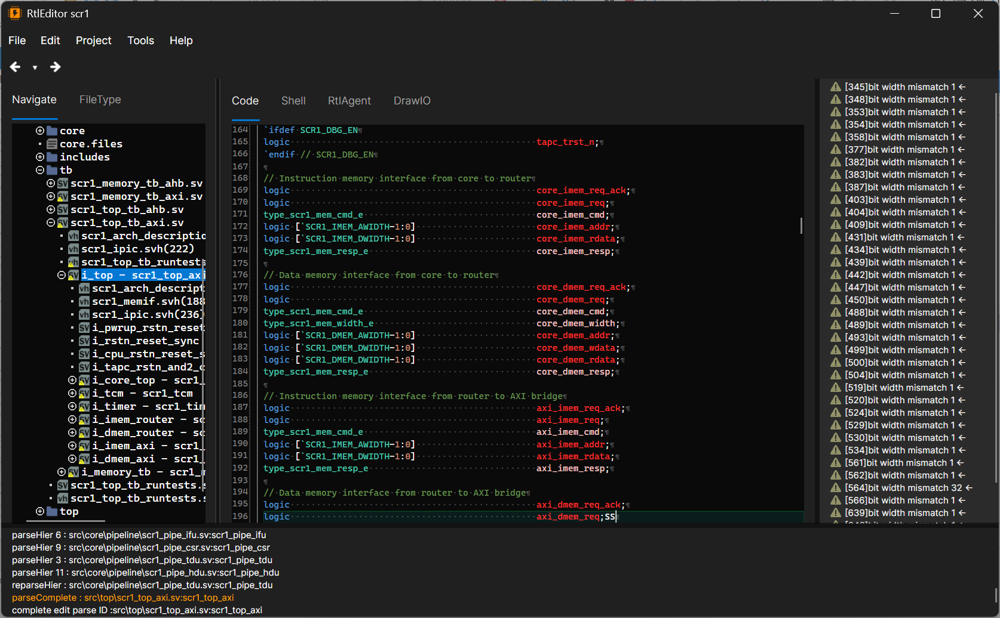

# RtlEditor2

A lightweight, modular Integrated Development Environment (IDE) for RTL design, focusing on Verilog and SystemVerilog.

> [!IMPORTANT]
> **Beta Version Notice**: This project is currently in the early prototype stage. While functional, features are subject to change, and SystemVerilog support is ongoing.

## Key Features

* **Hierarchy Awareness**: Built-in Verilog/SystemVerilog parser that understands `parameter` and `generate` blocks.
* **Tree Navigation**: Visualize and navigate through complex module instance hierarchies.
* **Intelligent Completion**: Context-aware code completion based on the parsed RTL structure.
* **Modular Architecture**: Highly customizable through a plugin-based system. You can reconfigure and recompile the editor to tailor the environment to your specific workflow.

## Language Support

* **Verilog (IEEE 1364)**: Core features fully supported.
* **SystemVerilog (IEEE 1800)**: Partial support (Active development in progress).

## Customization (Plugin System)

This editor is designed with modularity at its core. By swapping out or modifying plugins and recompiling the source, you can optimize the IDE for your specific HDL environment.

## Roadmap / Known Limitations

* Full SystemVerilog syntax support.
* Enhanced linting integration.
* Performance optimization for massive design hierarchies.

## License

This project is licensed under the **MIT License**. See the [LICENSE](https://www.google.com/search?q=LICENSE) file for details.
