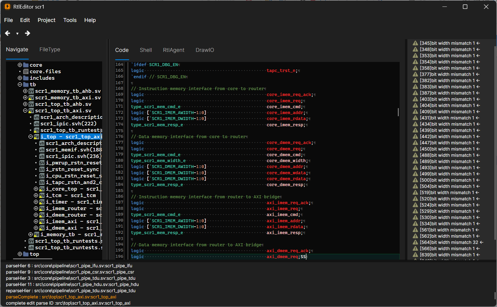

# RtlEditor2

A lightweight, **modular IDE library** for RTL design, built with **Avalonia UI**.



> [!IMPORTANT]
> **Beta Version Notice**: This project is currently in the early prototype stage. While functional, features are subject to change, and SystemVerilog support is ongoing.

## What is RtlEditor2?

RtlEditor2 is not just a finished IDE application—it is a **highly customizable IDE library** that you can tailor to your specific needs. By adjusting and recompiling plugins, you can create a customized editor with the exact features you require for your RTL design workflow.

**Key Characteristics**:
- 📦 **IDE Library**: Build your own custom RTL IDE by selecting and configuring plugins
- 🔌 **Plugin-Based Architecture**: Add/remove features by enabling or disabling plugins
- 🌍 **Cross-Platform**: Runs on both **Linux** and **Windows** without code changes
- ⚡ **Tailor-Made**: Implement only the features you need for your specific implementation environment

## Key Features

* **🏗️ Hierarchy Awareness**: Built-in Verilog/SystemVerilog parser that understands `parameter` and `generate` blocks.
* **🌳 Tree Navigation**: Visualize and navigate through complex module instance hierarchies.
* **🤖 Intelligent Completion**: Context-aware code completion based on the parsed RTL structure.
* **🌍 Cross-Platform**: Powered by Avalonia UI, supporting both **Linux** and **Windows** with a single codebase.
* **🔌 Modular Plugin Architecture**: Highly customizable through a plugin-based system. Select and configure plugins to build your own custom RTL IDE for your specific implementation environment.

## Language Support

* **Verilog (IEEE 1364)**: Core features fully supported.
* **SystemVerilog (IEEE 1800)**: Partial support (Active development in progress).

**Supported Verilog Features**:
- trireg declarations with drive/charge strength
- tranif0, tranif1, rtranif0, rtranif1, tran, rtran gate instantiations
- let declarations and function calls
- Streaming concatenation
- case inside with range expressions
- Clocking blocks and default clocking
- Struct/union packed types

## Customization (Plugin System)

This editor is designed with modularity at its core. By **adjusting plugins and recompiling**, you can create a customized IDE that perfectly matches your implementation environment requirements.

### How to Customize

1. **Select Plugins**: Enable or disable plugins based on your needs
2. **Configure Features**: Adjust plugin settings for your specific workflow
3. **Recompile**: Build the IDE with your custom plugin configuration
4. **Deploy**: Use your tailored RTL IDE on Linux or Windows

### Available Plugins

| Plugin | Description |
|--------|-------------|
| CodeEditor2VerilogPlugin | Verilog/SystemVerilog language support |
| CodeEditor2AiPlugin | AI integration (LLM support) |
| CodeEditor2DrawIoPlugin | Draw.io diagram support |
| CodeEditor2IcarusVerilogPlugin | Icarus Verilog simulation integration |
| CodeEditor2MarkdownPlugin | Markdown support |
| CodeEditor2VivadoPlugin | Xilinx Vivado integration |

---

## Project Structure

```
RtlEditor2/                           # Main repository
├── RtlEditor2.Desktop/               # Main desktop application (entry point)
├── CodeEditor2/                      # Core editor component
├── CodeEditor2Plugin/                # Base plugin interface
├── CodeEditor2VerilogPlugin/         # Verilog/SystemVerilog language support
├── CodeEditor2AiPlugin/              # AI integration plugin (optional)
├── CodeEditor2DrawIoPlugin/          # Draw.io diagram support (optional)
├── CodeEditor2IcarusVerilogPlugin/   # Icarus Verilog simulation (optional)
├── CodeEditor2MarkdownPlugin/        # Markdown support (optional)
├── CodeEditor2VivadoPlugin/          # Xilinx Vivado integration (optional)
├── AjkAvaloniaLibs/                  # Avalonia UI utility library
└── AvaloniaEdit/                     # Text editor control

# Build & Run
- Both Linux and Windows: dotnet build && dotnet run
- No platform-specific code required
```

## Build
```bash
# Build entire project
dotnet build "RtlEditor2.Desktop.csproj"
```

---

## Roadmap / Known Limitations

### In Progress
- Enhanced linting integration
- Performance optimization for massive design hierarchies
- Full SystemVerilog syntax coverage

## License

This project is licensed under the **MIT License**. See the [LICENSE](https://google.com/search?q=LICENSE) file for details.
